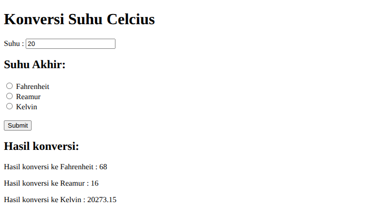

# Application Temperature Converter
Practice DOM with create application temperature converter from Celcius to Fahrenheit, Reamur, Kelvin (show results)

## Screenshot

## How it works?
1. Input temperature in celcius on input column. (now still hardcode in value input html)
2. Select which final temperature you want. (now didnt work yet)
3. Conversion result will show in bottom page